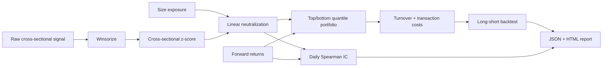

# Quant Factor Research

A reproducible cross-sectional factor-research project covering **winsorization, z-scoring, exposure neutralization, information coefficient analysis, long/short portfolio construction, turnover and transaction-cost sensitivity**.

The public baseline is fully synthetic. It exists to make the research process inspectable without suggesting that the generated factor is a tradable real-market alpha signal.

## Research pipeline



## Implemented research mechanics

- cross-sectional winsorization at configurable quantiles;
- standardized factor scores;
- linear residualization against a nuisance exposure (synthetic size in the demo);
- daily **Spearman information coefficient**;
- IC mean, positive-IC rate and an illustrative annualized IC information ratio;
- dollar-neutral top/bottom quantile long-short weights;
- portfolio turnover from changes in cross-sectional holdings;
- explicit transaction-cost deduction;
- cumulative gross/net return, annualized volatility, Sharpe and maximum drawdown;
- cost sensitivity at `0 / 2 / 5 / 10 / 20` bps;
- Benjamini-Hochberg false-discovery control across tested factor hypotheses.

## Multiple-testing guardrail

Factor discovery often evaluates many candidate signals, so an unadjusted `p < 0.05`
rule can promote chance findings. `quantfactor.multiple_testing.benjamini_hochberg`
accepts named p-values, returns monotone adjusted p-values, and records the decision
at a configurable false-discovery rate.

```python
from quantfactor.multiple_testing import benjamini_hochberg

results = benjamini_hochberg(
    [("momentum", 0.004), ("value", 0.03), ("quality", 0.40)],
    false_discovery_rate=0.05,
)
publishable = [result.name for result in results if result.rejected]
```

Names and probability bounds are validated, duplicate hypotheses fail closed, input
order is preserved, and every result is JSON-ready through `to_dict()`.

This controls the expected false-discovery proportion for the supplied family of
tests. It does not repair data snooping, correlated research choices, a biased
universe, weak p-value construction, or repeated experimentation that is omitted
from the declared hypothesis family.

## Synthetic factor panel

`quantfactor/synthetic.py` creates a changing cross-section with latent momentum, value and quality components, plus a nuisance size exposure. Forward returns contain a weak known relation to the synthetic composite signal plus substantial noise.

That construction is useful for testing whether the research machinery behaves coherently. It is **not** evidence of real alpha.

## Quick start

```bash
python -m venv .venv
source .venv/bin/activate  # Windows: .venv\Scripts\activate
pip install -r requirements.txt
python -m quantfactor.cli --dates 500 --assets 80 --cost-bps 5
```

Outputs:

```text
artifacts/factor_results.json
artifacts/factor_report.html
```

## API

```bash
uvicorn app.api:app --reload
curl "http://localhost:8000/demo?dates=300&assets=60&cost_bps=5"
```

## Why turnover is first-class

A cross-sectional backtest can look excellent before implementation costs. Re-ranking an entire universe every period can require large changes in positions, so the repository reports average turnover and recomputes cumulative results over several cost assumptions. This does not solve market-impact modeling, but it prevents a zero-cost backtest from being the only headline number.

## Research limitations

A serious real-market project would still need:

- point-in-time constituent and fundamental data;
- delisting/survivorship handling;
- corporate actions;
- sector/country/beta/volatility neutralization;
- realistic rebalance calendars and execution delay;
- borrow constraints and shorting costs;
- capacity/market-impact analysis;
- out-of-sample and live-paper evaluation.

These are stated explicitly rather than hidden behind a synthetic Sharpe ratio.

## Docker

```bash
docker build -t quant-factor-research .
docker run --rm -p 8000:8000 quant-factor-research
```

## Tests / CI

```bash
ruff check .
pytest -q
```

GitHub Actions runs a reduced synthetic experiment and builds the container.

## Portfolio signal

**Python · NumPy · Pandas · factor research · cross-sectional statistics · IC · neutralization · long/short portfolios · transaction costs · multiple-testing control · backtesting · FastAPI · Docker · CI/CD**
